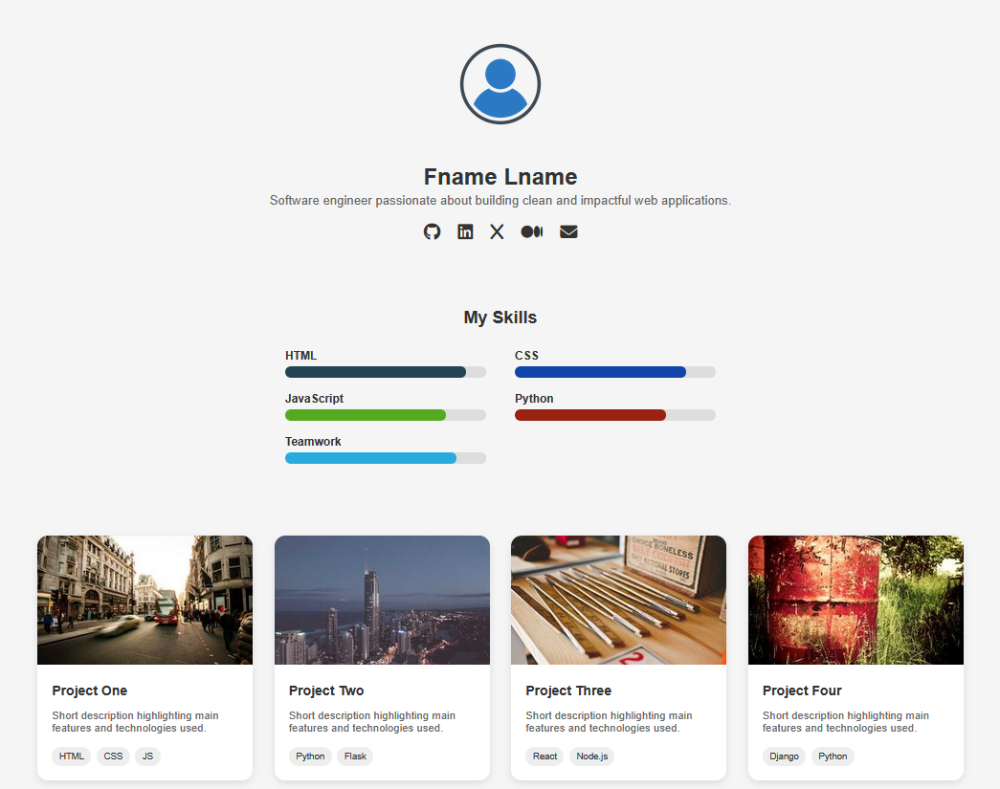

# x-Portfolio



## Description

This is a personal portfolio website built with Jekyll. It showcases key information about the user, including:

- A profile section (name, bio, profile image)  
- Social links  
- Skills  
- Projects  

It is designed to be clean, responsive, and easy to maintain.  

## Features

- Dynamic content using Jekyll collections for **skills** and **projects**.  
- Each project includes title, description, tags, image, and an external link.  
- Skills section showing proficiency of each skill.  
- Social links and contact email in the header.  
- The site works out-of-the-box with GitHub Pages.

## Project Structure

```
/
├── _config.yml
├── _layouts/
│   └── default.html
├── _includes/
│   ├── header.html
│   ├── skills.html
│   └── projects.html
├── _projects/
│   ├── project1.md
│   ├── project2.md
│   └── ...
├── _skills/
│   ├── html.md
│   ├── css.md
│   └── ...
├── assets/
│   ├── style.css
│   └── images/
│       ├── cover.png
│       └── profile.jpg
└── index.html
```

- `cover.png` — a cover image displayed in the README.  
- `_projects/` — collection of project files.  
- `_skills/` — collection of skill files.  
- `_includes/` — reusable pieces: header, skills loop, project loop.  
- `_layouts/default.html` — main HTML skeleton.  

## Usage

1. Clone the repo:

   ```bash
   git clone https://github.com/yourusername/x-portfolio.git
   ```

2. Install Jekyll if needed:

   ```bash
   gem install jekyll bundler
   ```

3. Preview locally:

   ```bash
   bundle exec jekyll serve
   ```

   Then open your browser at `http://localhost:4000`.
4. To change name, bio, or social links edit the _config.yaml file. 
5. To add a new project: create a new Markdown file in `_projects/` with front matter (title, description, tags, image, link).  
6. To add a new skill: add a new Markdown file in `_skills/` with front matter (name, percent, [color if used]).
